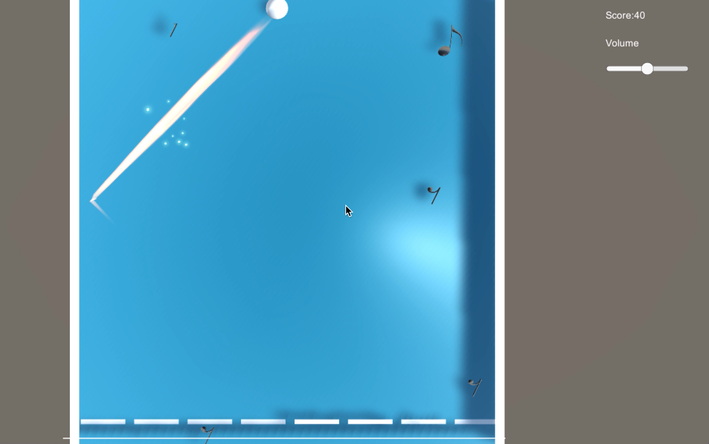
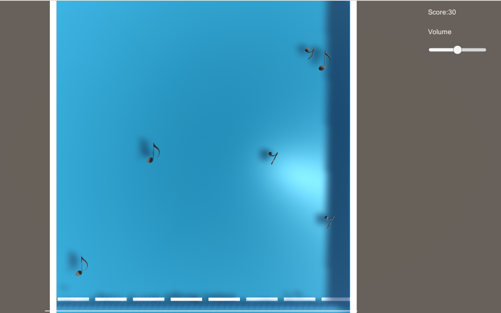

# GameDesign_PianoBall

> 結合音樂要素，需要在使用擋板防止彈珠掉落之餘    
> 使用擋板trigger音符得分（休止符扣分）  
> 一開始的遊戲畫面按enter進入，  
> space發球  
> ASDFJKL:對應八個擋板  
> 旁邊的slider可以操控音量大小  

+ Video:
+ Project:[https://drive.google.com/drive/folders/0B0k75ehZqEBrdkVTaGtWQVhFTUk?usp=sharing](https://drive.google.com/drive/folders/0B0k75ehZqEBrdkVTaGtWQVhFTUk?usp=sharing)
